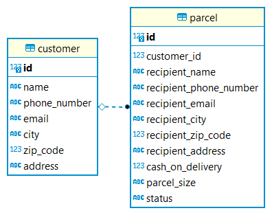

# SmartPack

This application is a coursework, it is a simple backend for a package delivery company.


## General information

* There are two entities, Customer and Parcel, witch are in 1-n relationship.



* Parcel cannot exist without a Customer. At creation, the Parcel must be provided with an existing 
  Customer ID, deletion of a Customer also deletes all of its Parcels.

* In addition to the standard CRUD functions for both entities, the API provides endpoint to list 
  the Parcels of a given Customer.

* The Status of a newly created parcel always set to "NEW". (Other given values will be overwritten.)

* DTO is implemented for both entities, the ParcelSize and Status are enums.
  
* The controller classes covered with unit and integration tests.


## Setup

1. The ```smartpack-docker-build.bat``` builds the Docker Image. The Dockerfile written as a
   multi-stage build, the project compiled and packaged automatically before the actual Image build. 
   You can populate the database with some test data if you copy the ```afterMigrate.sql``` file to 
   the ```src/main/resources/db/migration``` folder before the build.
  
2. The ```smartpack-docker-run.bat``` creates a container from the built Image and runs it. (The 
   application published to the 8080 port.)
  
   
## Technologies

* Java
  
* Spring Boot

* Spring Data JPA

* H2 Database
  
* Flyway

* Swagger

* Docker